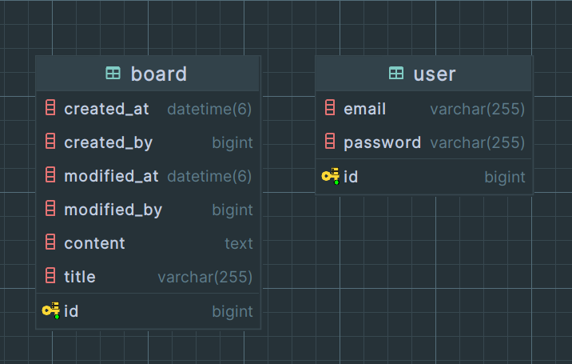

# README

## 지원자의 성명

문성하

## 애플리케이션의 실행 방법 (엔드포인트 호출 방법 포함)

*mysql, redis container 를 위한 docker가 필요합니다.

`sh ./run-server.sh`

[REST DOCS](https://htmlpreview.github.io/?https://github.com/azqazq195/wanted-pre-onboarding-backend/blob/master/src/main/resources/static/docs/restdocs.html)

## 데이터베이스 테이블 구조

  

## 구현한 API의 동작을 촬영한 데모 영상 링크

## 구현 방법 및 이유에 대한 간략한 설명

- jwt logout은 redis에 blacklist로 관리하였습니다.
- 토큰 재발행을 위해 refresh Token을 저장합니다.
- 이외 구현사항은 요구사항만 만족시키도록 작성하였습니다.

## API 명세(request/response 포함)

[REST DOCS](https://htmlpreview.github.io/?https://github.com/azqazq195/wanted-pre-onboarding-backend/blob/master/src/main/resources/static/docs/restdocs.html)
